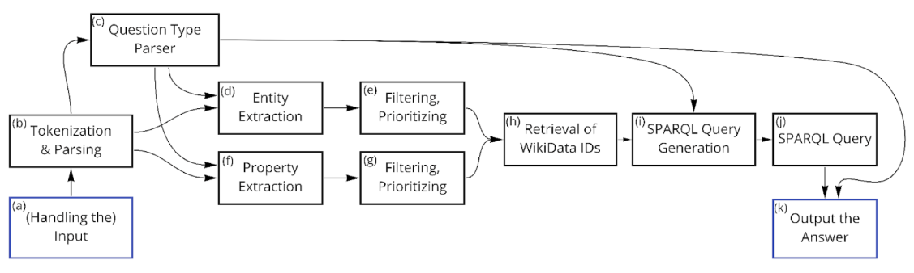

# Question-Answering System on Movies using Spacy and Wikidata

This QA system answers questions was created during the course Language Technology Practical at the University of Groningen. It uses [Spacy](https://spacy.io/) for natural language processing library and [wikidata](https://www.wikidata.org/) as a knowledge base. Wikidata was accessed through SPARQL queries on their [query API](https://query.wikidata.org/).

.

On a test set (`test_all1.csv`), the system answered 26.5 out of the 48 movie-related questions correctly. It performed well on simple syntax, count questions, and modified questions (with keywords) to narrow down properties. What didn’t work too well were, for instance, qualifier questions.